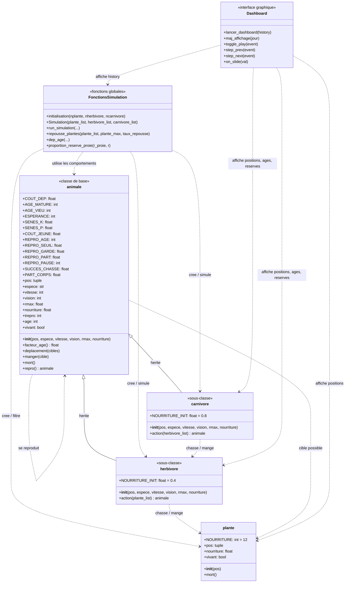

# Diagramme UML de la simulation

## Relations principales

- `herbivore` et `carnivore` heritent de `animale`.
- Un `herbivore` se deplace vers des `plante` et peut les manger.
- Un `carnivore` se deplace vers des `herbivore` et peut les manger.
- `animale.repro()` cree un nouvel objet du meme type que le parent.
- Les fonctions globales gerent l'initialisation, un jour de simulation, la repousse des plantes et l'historique.
- `Dashboard` lit l'historique produit par `run_simulation()` pour afficher la simulation.
